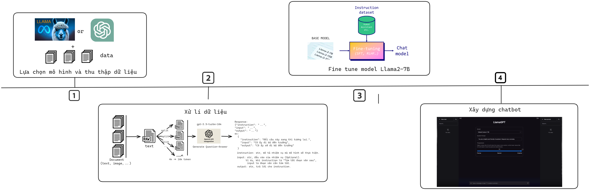

# Fine-Tuning Large Language Models & Deploy Chatbot UI

## Getting started

Welcome to the Chatbot LLM (Large Language Model) project!
To get started with the Chatbot LLM, follow the instructions below: 

## Road map

<!-- Include the image below -->

## Data preparation
From a PDF document, extract its textual content, then generate question-answer pairs based on that document.

### Extract text content from pdf file
Using [extract text code](Code/data-processing/extract-text-from-pdf-file) to get textual chunks of pdf documents. 
### Generate questions:
Given extracted text chunks, [generate all possible questions](Code/data-processing) by LlamaIndex and OpenAI API.

### Generate answers:
[Generate corresponding answer sets](Code/data-processing) by RAG Langchain and OpenAI API.

## Fine - tuning model
### Fine - tuning:
Run [fine-tuning notebook](Code/fine-tuning) to get lora weights in downstream task.
### Convert all necessary files to one .gguf file:
Follow [convert-gguf notebook](Code/fine-tuning) to merge base model and fine-tuned lora adapter. 

## Integrate chatbot into web UI
Activate the [check-database-api](Code/check-exist-api) to verify if the user's question is present in the database. If it is, this API will promptly provide the corresponding answer; otherwise, proceed to call the chatbot model.

### Run on colab
Integrate model with backend api by [colab code](Code/run-web/run-on-colab)

### Run on server
Follow the instructions [here](Code/run-web/run-on-server) to run web chatbot
